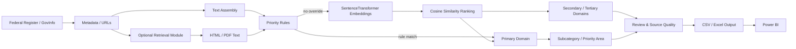

# Executive Orders Policy Intelligence & Analytics Platform

A provenance-aware document-intelligence project for collecting, classifying, and analyzing U.S. presidential documents using deterministic policy rules, SentenceTransformer semantic similarity, hierarchical taxonomy, human-review controls, and Power BI-oriented outputs.

> **Project status:** public, sanitized reconstruction based on recovered historical source code and artifacts. The original internal project name was **SUBCOMMITTEE**. Work-specific paths and private configuration are excluded.

## What this repository demonstrates

- Federal Register / GovInfo document metadata workflows
- isolated HTML and PDF text-retrieval helpers with URL-keyed caching
- hybrid classification: deterministic priority rules first, semantic similarity second
- SentenceTransformer embeddings with `all-MiniLM-L6-v2`
- 14-domain policy taxonomy with ordered rule-based subcategories
- primary, secondary, and tertiary domain signals
- confidence/review heuristics and source-quality indicators
- Power BI-oriented output fields and date enrichment
- recovered Power Query / DAX lineage
- explicit RECOVERED / RECONSTRUCTED / ENHANCED provenance boundaries

## Architecture



The recovered historical V3 implementation integrated URL enrichment directly into the classifier workflow. In the public repository, retrieval is isolated in `retrieval.py`; the portable CLI currently classifies text already present in the input dataset. This keeps network behavior explicit and testable.

## Classification approach

The recovered workflow established the following design:

1. Assemble title, abstract, summary, and description fields when available.
2. Optionally enrich records with public HTML/PDF document text.
3. Apply deterministic priority rules for selected high-priority categories.
4. Embed document text and 14 domain descriptions with `all-MiniLM-L6-v2`.
5. Rank domains by cosine similarity.
6. Preserve alternative domain signals for review.
7. Derive subcategory, affected-sector, policy-impact, source-quality, and review fields.

Similarity scores are **not calibrated probabilities**. No validated labeled benchmark was recovered, so this repository does not claim measured classification accuracy, precision, recall, or F1.

## Install

```bash
python -m venv .venv
# Windows: .venv\Scripts\activate
# macOS/Linux: source .venv/bin/activate
pip install -e ".[dev]"
```

## Run

Classify the included public sample without network enrichment:

```bash
eo-policy-intelligence data/sample/executive_orders_sample.csv \
  --output outputs/classified_sample.csv \
  --no-url-extraction
```

The first semantic-classification run may download the configured SentenceTransformer model from its upstream provider.

## Repository layout

```text
src/executive_order_intelligence/
  core.py                         taxonomy + deterministic rules
  pipeline.py                     semantic classification + review controls
  retrieval.py                    isolated public HTML/PDF retrieval helpers
  cli.py                          portable command-line workflow
data/sample/                       small public demonstration dataset
tests/                             deterministic unit tests
docs/                              architecture, schema, NLP, Power BI, provenance
powerbi/                           recovered/sanitized DAX and Power Query lineage
historical/                        historical recovery boundary and source hashes
.github/workflows/                 CI
```

## Provenance

Three complete historical Python versions were recovered from the original project history. Their source hashes and technical lineage are documented in [`docs/PROVENANCE.md`](docs/PROVENANCE.md). The verbatim historical files remain in the private recovery archive because they contain work-specific filesystem paths.

The public `src/` package is an **ENHANCED, SANITIZED DERIVATIVE**, not a byte-for-byte representation of the final work-computer copy.

## Limitations

- several historical rules use substring matching and can produce false positives for short terms;
- long documents are represented by a single embedding rather than chunked/aggregated embeddings;
- historical URL caches had no built-in expiry;
- source-quality and review fields are heuristics, not external validation;
- no labeled benchmark establishing formal model accuracy was recovered.

## Data

The sample dataset contains public presidential-document metadata for demonstration only. It is not a complete or current corpus.

## License

MIT. Public-government source documents remain subject to their source terms and applicable law.
