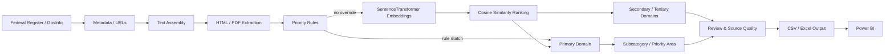

# Executive Orders Policy Intelligence & Analytics Platform

A provenance-aware document-intelligence pipeline for collecting, enriching, classifying, and analyzing U.S. presidential documents using deterministic policy rules, SentenceTransformer semantic similarity, hierarchical taxonomy, human-review controls, and Power BI-ready outputs.

> **Project status:** public reconstruction based on recovered historical source code and artifacts. The original internal project name was **SUBCOMMITTEE**. Work-specific paths and private configuration have been removed from this public version.

## What the project demonstrates

- Public-government document ingestion from Federal Register / GovInfo metadata and document URLs
- HTML and PDF text extraction with local caching
- Hybrid classification: deterministic priority rules first, semantic similarity second
- SentenceTransformer embeddings with `all-MiniLM-L6-v2`
- 14-domain policy taxonomy with rule-based subcategories
- Primary, secondary, and tertiary domain signals
- Confidence/review heuristics and source-quality indicators
- Power BI-oriented output fields and date enrichment
- Historical Power Query / DAX lineage and dashboard design
- Explicit provenance boundaries between recovered and enhanced code

## Architecture



## Classification approach

The recovered V3 workflow uses a hybrid strategy:

1. Assemble title/abstract/summary fields.
2. Optionally retrieve richer text from HTML/PDF URLs.
3. Apply deterministic priority rules for high-priority categories.
4. Embed the document text and 14 domain descriptions using `all-MiniLM-L6-v2`.
5. Rank domains by cosine similarity.
6. Apply documented adjustments intended to reduce over-broad classifications.
7. Derive subcategory, sector, policy-impact, source-quality, and review fields.

Similarity scores are **not calibrated probabilities**. This repository does not claim measured classification accuracy, precision, recall, or F1 because no validated labeled evaluation set was recovered.

## Install

```bash
python -m venv .venv
# Windows: .venv\Scripts\activate
# macOS/Linux: source .venv/bin/activate
pip install -e ".[dev]"
```

## Run

Use the included public sample without network enrichment:

```bash
eo-policy-intelligence data/sample/executive_orders_sample.csv \
  --output outputs/classified_sample.csv \
  --no-url-extraction
```

The first semantic-classification run may download the configured SentenceTransformer model from its upstream provider.

## Repository layout

```text
src/executive_order_intelligence/   portable public implementation
data/sample/                        small public example dataset
tests/                              deterministic unit tests
docs/                               architecture, schema, NLP, Power BI, provenance
powerbi/                            recovered/sanitized DAX and Power Query notes
historical/                         historical recovery boundary and source hashes
.github/workflows/                  CI
```

## Provenance

Three complete historical Python versions were recovered from the original project history. The recovered source files themselves are kept in a private recovery archive because they contain historical work-specific paths. Their SHA-256 hashes and technical lineage are documented in [`docs/PROVENANCE.md`](docs/PROVENANCE.md).

The public `src/` package is an **ENHANCED, SANITIZED DERIVATIVE**: it removes private paths and top-level side effects while retaining the recovered classification architecture and logic where practical.

## Limitations

- The historical implementation uses substring keyword matching in several rules; this can create false positives for short terms.
- Long documents are represented by a single embedding rather than chunked/aggregated embeddings.
- URL cache entries have no built-in expiry.
- Source-quality and review fields are heuristics, not external validation.
- The recovered project did not include a labeled benchmark establishing model accuracy.

## Data

The sample dataset contains public presidential-document metadata only. It is included for demonstration and is not intended to be a complete or current corpus.

## License

MIT. Public-government source documents remain subject to their source terms and applicable law.
