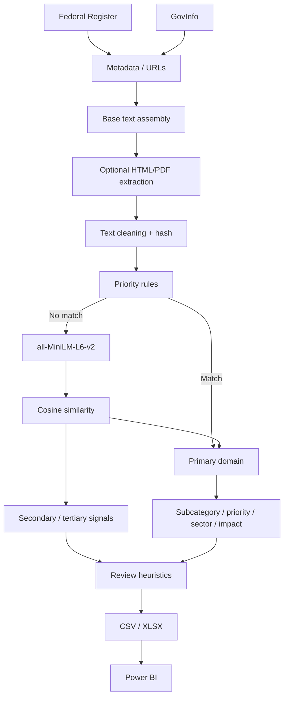

# Architecture

## Current public implementation

The public repository separates ingestion/enrichment, classification, quality controls, export, and BI consumption.

## Historical evolution

1. CSV/Excel → Power Query → Power BI → keyword classification.
2. RSS experimentation for Federal Register/GovInfo acquisition.
3. Python V1 hybrid rule + semantic classifier.
4. V2 URL enrichment, cache, multi-domain signals and richer provenance.
5. V3 stronger extraction, broader category-adjustment logic and revised review rules.

No production scheduler, database, model registry, or deployment platform is claimed in the recovered evidence.
